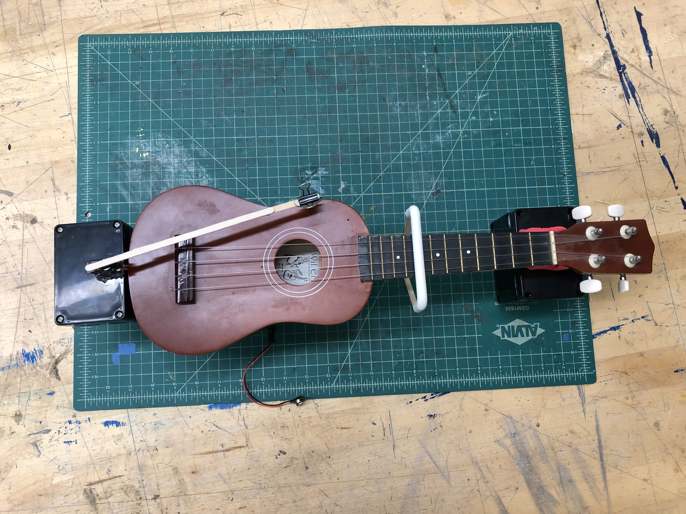
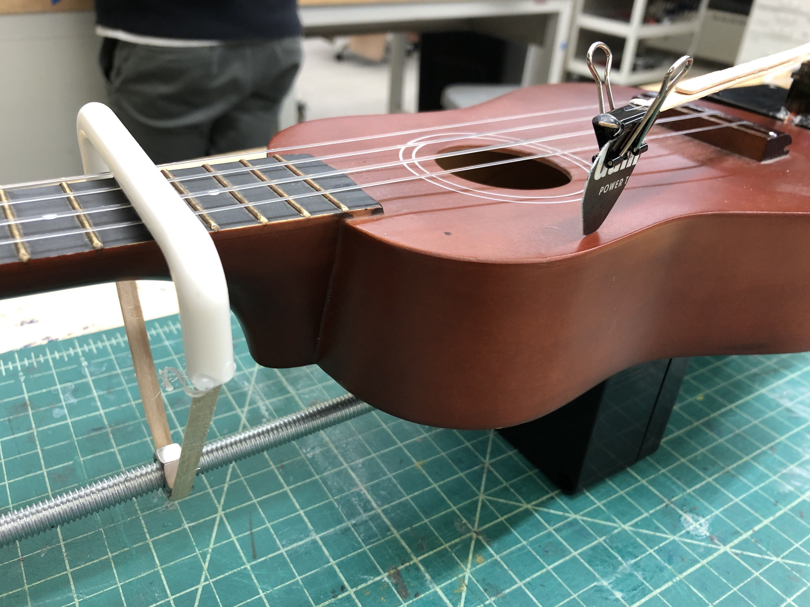
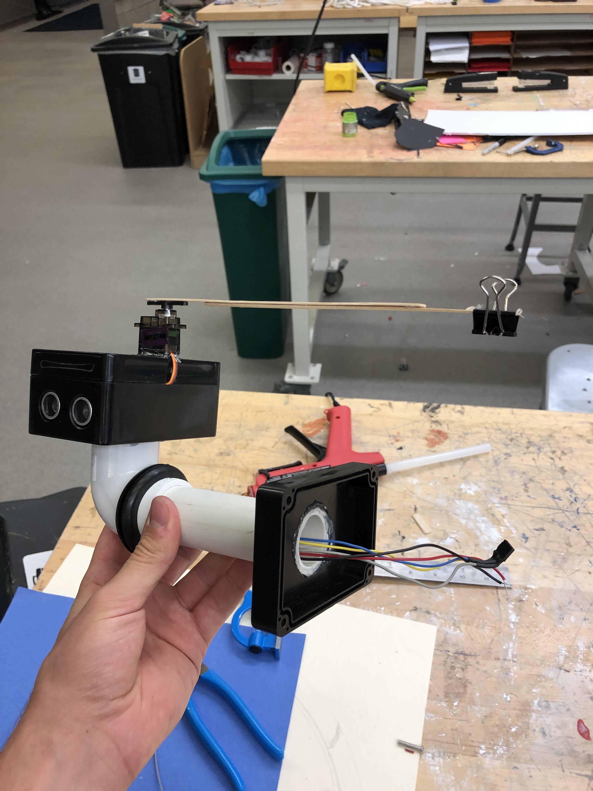

# Automatic-Ukelele-Player

For this project, we wanted to use motors to actuate a physical instrument. We saw many of examples of this with percussion instruments in class, but we wanted to try something a bit more ambitious and went with a stringed instrument. We settled on a Ukulele because of it's portability, and because its strings are relatively easy to manipulate. Originally, we thought we would change the pitch of the strings by adjust the tuning pegs, which would be clipped to Servo motors. However it quickly became apparent that this would not give us the level of control that we wanted, and so we decided to move a slider along the fretboard instead.

Our custom hardware can be broadly broken down into two parts; the sliding mechanism and the strumming mechanism, which are each contained in their own project box and connected via a PVC pipe. The sliding mechanism uses a DC motor, which is attached to a threaded rod via a 3D printed mold that fits the shaft of the DC motor. On the threaded rod, there is a single nut, which is attached by popsicle sticks to a plastic sliding mechanism which rests on the fretboard of the ukulele. When the threaded rod spins, it causes the stationary nut to move along the axis of the rod, thus causing the sliding mechanism to move upwards and downwards on the fretboard.

The strumming mechanism is controlled via a Servo motor. We attached a popsicle stick to the top of the servo motor, which has a guitar pick clipped to the end. This pick then strums across the ukulele strings (in either direction) when the Servo is activated.

These two parts are each contained and wired within their own project boxes. The DC motor is mounted on the inside of a project box attached under the ukulele, and extends under the fretboard to the neck of the instrument. It is then secured in place by another project box, whose only purpose is to hold the other end of the threaded rod. There is then a third project box attached to the front of the ukulele, is connected to the the under-mounted box via a PVC pipe. This front-mounted box contains the ESP32 and both ultrasonic sensors, and has holes drilled for power output, which is being supplied by a volt battery. The servo motor is glued to the top of the project box. 

The user controls the automatic player with two ultrasound sensors, which detects the distance at which the ultrasound waves are blocked. This allows the user to control the ukulele by moving their hands closer and further from the sensors. The sensor to the left of the ukulele controls the frequency of the strumming. The closer your move your hand to the sensor, the faster the strumming gets. The sensor to the right of the ukulele controls the speed and direction of the fretboard slider. At the closest hand position to the sensor, the slider moves down the fretboard at the highest speed. As you move your hand further away, the speed slows down, until you get to the midpoint at which the direction switches. 

We ran into a handful of issues while building the instrument. The primary one was figuring out how to attach the rather bulky threaded rod to a motor. We tried soldering and glueing, but ultimately both of these methods were too weak. We ended up 3D-printing a custom mold to attach the units together. Another issue was deciding which motor to use. Originally we were using a stepper motor, but this ended up being way too slow at moving the fretboard. We then switched to a DC motor, which was much faster. Another issue was applying an appropriate amount of pressure to the frets. Too much pressure and it would stifle the sound of the ukulele, but too little and the slider would fall over. To fix this, we used modeling clay, placed below the neck of the ukulele, which allowed to adjust the height of the instrument and thus effect how much pressure was being applied by the slider. 

## Some Photos

